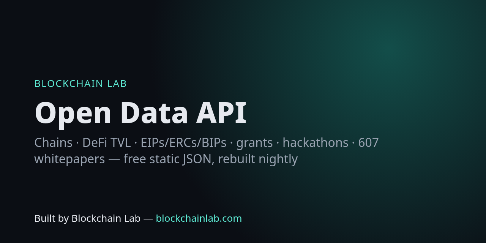

# Blockchain Lab Open Data API



**Free, static, CORS-enabled JSON datasets for blockchain builders, rebuilt nightly from public sources.** No API key, no backend, no rate limit beyond GitHub Pages.

> Built by **Blockchain Lab — [blockchainlab.com](https://blockchainlab.com/?utm_source=github&utm_medium=readme&utm_campaign=blockchainlab-api)**

- Docs: https://blockchains.github.io/blockchainlab-api/
- Catalogue: https://blockchains.github.io/blockchainlab-api/v1/index.json
- OpenAPI 3.1: [`openapi.yaml`](https://blockchains.github.io/blockchainlab-api/openapi.yaml) · [interactive](https://blockchains.github.io/blockchainlab-api/swagger.html)

## Datasets (20; counts as of 2026-10-04)

| Endpoint | Rows | What | Source | Schema |
|---|---|---|---|---|
| [`bips`](https://blockchains.github.io/blockchainlab-api/v1/bips.json) | 213 | Bitcoin Improvement Proposals index parsed from bitcoin/bips. | [github.com/bitcoin/bips](https://github.com/bitcoin/bips) | [schema](https://blockchains.github.io/blockchainlab-api/v1/schemas/bips.schema.json) |
| [`bridges`](https://blockchains.github.io/blockchainlab-api/v1/bridges.json) | 260 | Cross-chain and canonical bridges ranked by TVL (DefiLlama bridge categories). | [DefiLlama protocols (bridge categories)](https://api.llama.fi/protocols) | [schema](https://blockchains.github.io/blockchainlab-api/v1/schemas/bridges.schema.json) |
| [`chains`](https://blockchains.github.io/blockchainlab-api/v1/chains.json) | 2787 | EVM chain registry: chain IDs, native currency, public RPC endpoints and explorers. | [chainid.network (ethereum-lists/chains)](https://chainid.network/chains.json) | [schema](https://blockchains.github.io/blockchainlab-api/v1/schemas/chains.schema.json) |
| [`chains-tvl`](https://blockchains.github.io/blockchainlab-api/v1/chains-tvl.json) | 330 | DeFi TVL by chain (USD). Snapshot from DefiLlama. | [DefiLlama](https://api.llama.fi/v2/chains) | [schema](https://blockchains.github.io/blockchainlab-api/v1/schemas/chains-tvl.schema.json) |
| [`dex-volumes`](https://blockchains.github.io/blockchainlab-api/v1/dex-volumes.json) | 300 | DEX trading volume by protocol (top 300 by 24h). Snapshot from DefiLlama. | [DefiLlama overview/dexs](https://api.llama.fi/overview/dexs) | [schema](https://blockchains.github.io/blockchainlab-api/v1/schemas/dex-volumes.schema.json) |
| [`eips`](https://blockchains.github.io/blockchainlab-api/v1/eips.json) | 593 | EIPS index (number, title, status, type, category) parsed from ethereum/EIPs. | [github.com/ethereum/EIPs](https://github.com/ethereum/EIPs/tree/master/EIPS) | [schema](https://blockchains.github.io/blockchainlab-api/v1/schemas/eips.schema.json) |
| [`ercs`](https://blockchains.github.io/blockchainlab-api/v1/ercs.json) | 617 | ERCS index (number, title, status, type, category) parsed from ethereum/ERCs. | [github.com/ethereum/ERCs](https://github.com/ethereum/ERCs/tree/master/ERCS) | [schema](https://blockchains.github.io/blockchainlab-api/v1/schemas/ercs.schema.json) |
| [`events`](https://blockchains.github.io/blockchainlab-api/v1/events.json) | 7 | Upcoming blockchain events from the Blockchain Lab feeds. | [Blockchains/blockchainlab-feeds (ethglobal.com/events; devpost.com (blockchain hackathons))](https://raw.githubusercontent.com/Blockchains/blockchainlab-feeds/main/feeds/events/latest.json) | [schema](https://blockchains.github.io/blockchainlab-api/v1/schemas/events.schema.json) |
| [`fees`](https://blockchains.github.io/blockchainlab-api/v1/fees.json) | 300 | Protocol fees by protocol (top 300 by 24h). Snapshot from DefiLlama. | [DefiLlama overview/fees](https://api.llama.fi/overview/fees) | [schema](https://blockchains.github.io/blockchainlab-api/v1/schemas/fees.schema.json) |
| [`glossary`](https://blockchains.github.io/blockchainlab-api/v1/glossary.json) | 80 | Plain-language blockchain glossary from blockchainlab.com (concepts, protocol profiles, failure classes, stack layers). | [blockchainlab.com/learn/glossary](https://blockchainlab.com/learn/glossary) | [schema](https://blockchains.github.io/blockchainlab-api/v1/schemas/glossary.schema.json) |
| [`grants`](https://blockchains.github.io/blockchainlab-api/v1/grants.json) | 22 | Directory of blockchain ecosystem grant / funding programmes with official links. Curated by Blockchain Lab; link status re-checked nightly. No amounts are listed — read each programme's own page. | [Official programme pages (curated)](https://github.com/Blockchains/blockchainlab-api/blob/main/data/grants.json) | [schema](https://blockchains.github.io/blockchainlab-api/v1/schemas/grants.schema.json) |
| [`hackathons`](https://blockchains.github.io/blockchainlab-api/v1/hackathons.json) | 4 | Open and upcoming blockchain hackathons (Devpost, ETHGlobal). | [Blockchains/blockchainlab-feeds (devpost.com/api/hackathons (theme Blockchain, open+upcoming); ethglobal.com/events (future hackathons); X posts (leads only))](https://raw.githubusercontent.com/Blockchains/blockchainlab-feeds/main/feeds/hackathons/latest.json) | [schema](https://blockchains.github.io/blockchainlab-api/v1/schemas/hackathons.schema.json) |
| [`l2-metrics`](https://blockchains.github.io/blockchainlab-api/v1/l2-metrics.json) | 100 | Ethereum L2/L3 scaling projects: stage, category, stack, risk summary and Total Value Secured breakdown. From L2BEAT. | [L2BEAT public API](https://l2beat.com/api/scaling/summary) | [schema](https://blockchains.github.io/blockchainlab-api/v1/schemas/l2-metrics.schema.json) |
| [`protocols`](https://blockchains.github.io/blockchainlab-api/v1/protocols.json) | 500 | Top 500 DeFi protocols by TVL (USD), excluding CEXs. Snapshot from DefiLlama; not investment advice. | [DefiLlama](https://api.llama.fi/protocols) | [schema](https://blockchains.github.io/blockchainlab-api/v1/schemas/protocols.schema.json) |
| [`rpc-health`](https://blockchains.github.io/blockchainlab-api/v1/rpc-health.json) | 34 | Health of popular free public RPC endpoints (EVM chains, Solana, Bitcoin): reachability, latency, block lag vs best endpoint, chain-ID check. Probed from a GitHub Actions runner (US) at build time. | [Blockchain Lab probe (GitHub Actions)](https://github.com/Blockchains/blockchainlab-api/blob/main/scripts/build.mjs) | [schema](https://blockchains.github.io/blockchainlab-api/v1/schemas/rpc-health.schema.json) |
| [`sanctioned-addresses`](https://blockchains.github.io/blockchainlab-api/v1/sanctioned-addresses.json) | 1060 | Digital currency addresses on the US Treasury OFAC SDN list, per asset. Extracted daily from the official SDN XML by github.com/0xB10C. Compliance screening aid only — verify against the official list. | [OFAC SDN list via 0xB10C/ofac-sanctioned-digital-currency-addresses](https://github.com/0xB10C/ofac-sanctioned-digital-currency-addresses/tree/lists) | [schema](https://blockchains.github.io/blockchainlab-api/v1/schemas/sanctioned-addresses.schema.json) |
| [`security-incidents`](https://blockchains.github.io/blockchainlab-api/v1/security-incidents.json) | 1293 | Public record of crypto hacks and exploits: date, protocol, technique, classification, amount lost/returned. From DefiLlama's hacks database. | [DefiLlama hacks](https://api.llama.fi/hacks) | [schema](https://blockchains.github.io/blockchainlab-api/v1/schemas/security-incidents.schema.json) |
| [`stablecoins`](https://blockchains.github.io/blockchainlab-api/v1/stablecoins.json) | 426 | Stablecoins by circulating supply with price, peg mechanism and 1d/7d/30d supply change. Snapshot from DefiLlama. | [DefiLlama stablecoins](https://stablecoins.llama.fi/stablecoins?includePrices=true) | [schema](https://blockchains.github.io/blockchainlab-api/v1/schemas/stablecoins.schema.json) |
| [`whitepapers`](https://blockchains.github.io/blockchainlab-api/v1/whitepapers.json) | 607 | Blockchain Lab research corpus — whitepaper metadata (no paper text). Original sources linked. | [Blockchain Lab /api/v1/papers](https://blockchainlab.com/api/v1/papers) | [schema](https://blockchains.github.io/blockchainlab-api/v1/schemas/whitepapers.schema.json) |
| [`yields`](https://blockchains.github.io/blockchainlab-api/v1/yields.json) | 500 | Top 500 DeFi yield pools by TVL (>= $10m) with APY, base/reward split, IL risk. Snapshot from DefiLlama; APYs change constantly and are not advice. | [DefiLlama yields](https://yields.llama.fi/pools) | [schema](https://blockchains.github.io/blockchainlab-api/v1/schemas/yields.schema.json) |

**Versioning:** `/v1/` path, semver `schema_version` in every envelope, JSON Schema per dataset, nightly job refuses to publish data that fails validation. See [CHANGELOG.md](CHANGELOG.md).

**Typed SDKs:** `npm i github:Blockchains/blockchainlab-sdk` (TypeScript) · `pip install "git+https://github.com/Blockchains/blockchainlab-sdk#subdirectory=python"` — see [blockchainlab-sdk](https://github.com/Blockchains/blockchainlab-sdk).

Every file uses the same envelope:

```json
{ "dataset": "chains", "api_version": "v1", "schema_version": "1.1.0", "schema_url": "https://…/v1/schemas/chains.schema.json", "generated_at": "ISO-8601", "source": "...", "source_url": "https://...", "count": 0, "data": [ ... ] }
```

## Quick start

```bash
# Base mainnet RPCs + explorer
curl -s https://blockchains.github.io/blockchainlab-api/v1/chains.json | jq '.data[] | select(.chainId==8453)'
# Top 10 DeFi protocols by TVL (DefiLlama snapshot)
curl -s https://blockchains.github.io/blockchainlab-api/v1/protocols.json | jq '.data[:10][] | {name, tvl_usd}'
# Final ERCs
curl -s https://blockchains.github.io/blockchainlab-api/v1/ercs.json | jq '.data[] | select(.status=="Final") | "ERC-\(.number) \(.title)"'
```

```js
const { data } = await (await fetch("https://blockchains.github.io/blockchainlab-api/v1/whitepapers.json")).json();
console.log(data.filter(p => p.topics?.includes("Proof of stake")).map(p => p.title));
```

## How it works

`scripts/build.mjs` (Node 20, zero dependencies) runs nightly in [GitHub Actions](.github/workflows/nightly.yml), fetches each public source, normalises it and commits `v1/*.json`. If a source fails, the previous file is kept and flagged `stale` in `index.json`.

- **chains** — [chainid.network](https://chainid.network/chains.json) (ethereum-lists/chains, the data behind chainlist.org); RPCs with `${API_KEY}` placeholders removed.
- **protocols / chains-tvl** — [DefiLlama public API](https://api-docs.defillama.com/). CEXs excluded from protocols. Snapshot, not advice.
- **hackathons / events** — reused from [Blockchains/blockchainlab-feeds](https://github.com/Blockchains/blockchainlab-feeds) (Devpost, ETHGlobal), not re-scraped.
- **whitepapers** — metadata from Blockchain Lab's [research corpus API](https://blockchainlab.com/api/v1/papers); each row links to the original source and to the [Blockchain Lab whitepaper page](https://blockchainlab.com/whitepaper?utm_source=github&utm_medium=readme&utm_campaign=blockchainlab-api).
- **glossary** — Blockchain Lab's concept, protocol, failure-class and stack-layer pages ([/learn/glossary](https://blockchainlab.com/learn/glossary?utm_source=github&utm_medium=readme&utm_campaign=blockchainlab-api)).
- **grants** — curated list of official programme pages ([`data/grants.json`](data/grants.json)); link status re-checked on every build. No amounts are listed — they change; read the programme page.
- **eips / ercs / bips** — parsed from front-matter in [ethereum/EIPs](https://github.com/ethereum/EIPs), [ethereum/ERCs](https://github.com/ethereum/ERCs) and [bitcoin/bips](https://github.com/bitcoin/bips).

Run locally: `node scripts/build.mjs && python3 scripts/openapi.py`

## Part of the Blockchain Lab open toolkit

| | |
|---|---|
| [blockchainlab-tools](https://blockchains.github.io/blockchainlab-tools/) | Client-side dev tools: gas, units, ABI, tx decoder, ENS, merkle, storage slots |
| [blockchainlab-mcp](https://github.com/Blockchains/blockchainlab-mcp) | MCP server + JS SDK for AI agents over this API |
| [blockchainlab-lens](https://github.com/Blockchains/blockchainlab-lens) | Explain any Etherscan address / tx with the tools |
| [blockchainlab-labs](https://github.com/Blockchains/blockchainlab-labs) | 30 hands-on Foundry labs with CI |
| [blockchain-dev-roadmap](https://github.com/Blockchains/blockchain-dev-roadmap) | Curated developer roadmap |
| [blockchain-interview-questions](https://github.com/Blockchains/blockchain-interview-questions) | Interview question bank |
| [blockchainlab-feeds](https://github.com/Blockchains/blockchainlab-feeds) | Hackathon / event / X-intel feeds |

## Licence

Code: MIT. Data: belongs to each named source — check its terms. Glossary text © Blockchain Lab; please attribute and link [blockchainlab.com](https://blockchainlab.com/?utm_source=github&utm_medium=readme&utm_campaign=blockchainlab-api).

---
Built by Blockchain Lab — [blockchainlab.com](https://blockchainlab.com/?utm_source=github&utm_medium=readme&utm_campaign=blockchainlab-api)
